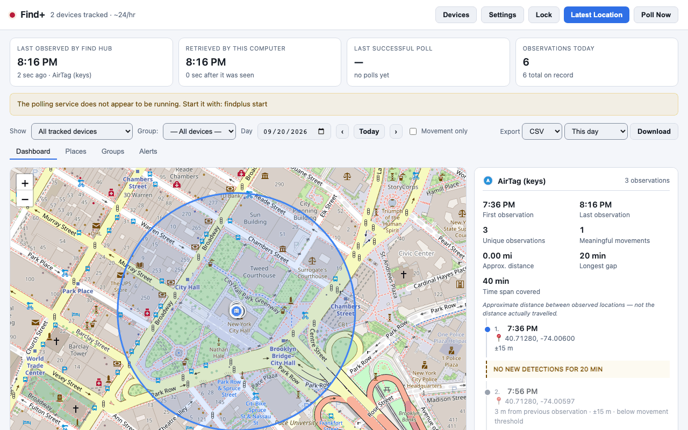

# Find+

Local location history for Google Find Hub and Apple Find My trackers.

## What it is

Find+ is a privacy-first daemon that polls your Find Hub and Find My
accounts on a schedule and stores every distinct sighting in a local SQLite
database. It serves a map, timeline, places, groups and alerts through a
browser dashboard, a CLI, a REST API, an MCP server, and a macOS menu-bar
app.

> This history consists of locations reported through Google's Find Hub
> network. Moto Tag uses nearby participating Android devices to report its
> location. Location updates can therefore be delayed, sparse, or
> unavailable, and this application should not be treated as real-time
> emergency or child-safety GPS tracking.

## What it is not

- Not real-time GPS tracking. Locations arrive whenever the provider's
  network reports them, which can be minutes to hours late.
- Find+ is not affiliated with Apple or Google. Find Hub and Find My are
  their trademarks.
- Not a replacement for emergency tracking or child-safety monitoring.

## Screenshots



More views (timeline, places, groups, alerts, the lock screen, both
themes) are in [`.github/docs/screenshots/`](.github/docs/screenshots/).
Regenerate them with `python packaging/scripts/screenshots.py`.

## Install

**One-line (macOS/Linux):**

```bash
curl -fsSL https://raw.githubusercontent.com/acamarata/findplus/main/install.sh | bash
```

Add `-s -- --start` to install and set the service up in the same command:

```bash
curl -fsSL https://raw.githubusercontent.com/acamarata/findplus/main/install.sh | bash -s -- --start
```

A fresh install ends by asking you to sign in, which is the expected finish, not
an error. See the [Install](https://github.com/acamarata/findplus/wiki/Install)
wiki page for a pinned-version URL.

**pipx:**

```bash
pipx install findplus
```

Requires Python 3.12, 3.13 or 3.14.

**macOS app (dmg):** download `FindPlus-<version>-aarch64.dmg` from
[Releases](https://github.com/acamarata/findplus/releases).

## First run

```bash
findplus auth
findplus start
```

The dashboard opens at http://localhost:8647.

## Features

- Location history with a map and chronological timeline.
- Places and geofence alerts, with configurable enter/exit confirmations.
- Groups and quorum-based presence (together, partial, unknown).
- Telegram and webhook alert channels.
- MCP server exposing devices, places, groups and history as LLM tools.
- macOS menu-bar app (Tauri) with a WidgetKit widget.
- Device and group labels with a 48-icon picker or a coloured letter badge, and 12 accent colours.
- WhatsApp alerts via CallMeBot, alongside Telegram, webhook, and native macOS notifications.
- In-dashboard sign-in for Google Find Hub and Apple Find My, no terminal required.
- Guided first-run setup wizard covering sign-in, devices, groups, places, notifications and app lock.
- Configurable poll interval (5-1440 minutes) and history retention.

Apple Find My accessories require pairing keys; genuine AirTags require
extracting pairing keys, which most users cannot do.

## Privacy

All data lives in `~/.findplus/` (SQLite). There is no cloud sync. Find+
sends no analytics or telemetry.

## Honesty

> This history consists of locations reported through Google's Find Hub
> network. Moto Tag uses nearby participating Android devices to report its
> location. Location updates can therefore be delayed, sparse, or
> unavailable, and this application should not be treated as real-time
> emergency or child-safety GPS tracking.
>
> Apple Find My locations come from nearby Apple devices and can be
> delayed, sparse or unavailable. Find+ can only query accessories whose
> keys you hold; genuine AirTags require extracting pairing keys, which
> most users cannot do.
>
> Alerts inherit the network's delay. An arrival or departure may be
> reported minutes to hours late.
>
> A tag with no recent fix is stale, not at home and not left behind.
> Find+ reports it as unknown.
>
> The app lock stops casual browsing. It does not encrypt the database;
> anyone with access to this user account or the disk can read it. Use
> FileVault.
>
> WhatsApp alerts are relayed through CallMeBot, a third-party free
> service. Your alert text transits CallMeBot's servers before reaching
> WhatsApp. Delivery is best-effort with no guarantee. Find+ is not
> affiliated with WhatsApp, Meta or CallMeBot.
>
> To connect WhatsApp: add +34 623 91 22 04 to your phone's contacts,
> then send it the message "I allow callmebot to send me messages" from
> your own WhatsApp. CallMeBot replies with an API key within about
> two minutes — paste it below.
>
> Notifications are held while Find+ is locked. Unlock to see what you
> missed.
>
> By default, macOS notifications show a generic "Find+ alert" instead
> of who or where, because notification banners can appear on a locked
> screen. Turn on notification details in Settings to show the person
> and place — anyone who can see the screen then sees the same thing.
>
> Find+ is not affiliated with Apple or Google. Find Hub and Find My are
> their trademarks.
>
> Google Chrome was not found on this machine. Google sign-in drives
> Chrome directly and cannot run without it. Install it from
> https://www.google.com/chrome/ and try again.

## CLI

See [CLI reference](https://github.com/acamarata/findplus/wiki/CLI-reference).
Start with `findplus --help`.

## API

See [API reference](https://github.com/acamarata/findplus/wiki/API-reference).
The OpenAPI schema is at http://localhost:8647/api/openapi.json. There is no
Swagger or ReDoc page: both fetch scripts from a CDN, which invariant 9 forbids.

## MCP

See [MCP](https://github.com/acamarata/findplus/wiki/MCP). Start with
`findplus mcp --help`.

## Licence

Find+ is GPL-3.0-or-later. It includes:

- [GoogleFindMyTools](https://github.com/leonboe1/GoogleFindMyTools) by
  @leonboe1, GPL-3.0 (vendored, license preserved in
  `cli/vendor/GoogleFindMyTools/LICENSE`).
- [FindMy.py](https://github.com/malmeloo/FindMy.py) by @malmeloo, MIT
  (acknowledgement; not vendored directly).
- [Leaflet](https://leafletjs.com), BSD-2-Clause.

Find+ is not affiliated with Apple or Google. Find Hub and Find My are
their trademarks.
