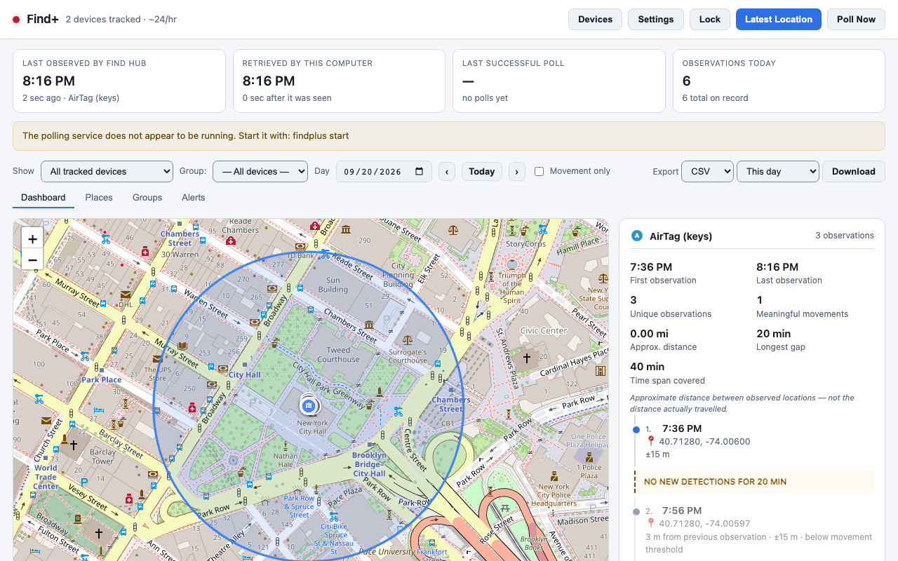

# Find+

Local location history for Google Find Hub and Apple Find My trackers.

## What it is

Find+ is a privacy-first daemon that polls your Find Hub and Find My
accounts on a schedule and stores every distinct sighting in a local SQLite
database. It serves a map, timeline, places, groups and alerts through a
browser dashboard, a CLI, a REST API, an MCP server, and a macOS menu-bar
app.

> This history consists of locations reported through Google's Find Hub
> network. Your trackers use nearby participating Android devices to report their
> location. Location updates can therefore be delayed, sparse, or
> unavailable, and this application should not be treated as real-time
> emergency or child-safety GPS tracking.

## What it is not

- Not real-time GPS tracking. Locations arrive whenever the provider's
  network reports them, which can be minutes to hours late.
- Find+ is not affiliated with Apple or Google. Find Hub and Find My are
  their trademarks.
- Not a replacement for emergency tracking or child-safety monitoring.

## Screenshots



More views (timeline, places, groups, alerts, the lock screen, both
themes) are in [`.github/docs/screenshots/`](.github/docs/screenshots/).
Regenerate them with `python packaging/scripts/screenshots.py`.

## Install

**One-line (macOS/Linux):**

```bash
curl -fsSL https://raw.githubusercontent.com/acamarata/findplus/main/install.sh | bash
```

Add `-s -- --start` to install and set the service up in the same command:

```bash
curl -fsSL https://raw.githubusercontent.com/acamarata/findplus/main/install.sh | bash -s -- --start
```

A fresh install ends by asking you to sign in, which is the expected finish, not
an error. See the [Install](https://github.com/acamarata/findplus/wiki/Install)
wiki page for a pinned-version URL.

**Homebrew (macOS):**

```bash
brew install acamarata/tap/findplus
```

**pipx:** Find+ is not on PyPI, so install the wheel from the latest release.
Download the `findplus-<version>-py3-none-any.whl` from
[Releases](https://github.com/acamarata/findplus/releases) (for example, v1.3.0):

```bash
pipx install https://github.com/acamarata/findplus/releases/download/v1.3.0/findplus-1.3.0-py3-none-any.whl
```

Or install from the latest release directly:

```bash
gh release download --repo acamarata/findplus --pattern '*.whl' && pipx install findplus-*.whl
```

Requires Python 3.12, 3.13 or 3.14.

**macOS app (dmg, Apple Silicon):** download `FindPlus-<version>-aarch64.dmg`
from [Releases](https://github.com/acamarata/findplus/releases). There is no
Intel build of the app; on an Intel Mac use Homebrew or the curl installer and
open the dashboard in your browser.

**Updates.** The macOS app updates itself: it checks GitHub every few hours,
downloads and verifies the new version, backs up your database, and restarts
into it while you are not using it. Turn this off in Settings > Updates. Details:
[Updates](.github/wiki/Updates.md).

**Update the macOS app by hand** (works while Find+ is running; keeps your history and settings):

```bash
curl -fsSL https://github.com/acamarata/findplus/releases/latest/download/update-app.sh | bash
```

The updater checks the download against the sha256 published on the same release.
That catches a corrupted download. It does not prove who published the release.

**Chrome helper (only if Google blocks the Find+ window).** The Find+ app signs in
to Google in a window of its own. If Google ever refuses that, or you use Find+ in a
browser tab instead of the app, the card falls back to the Find+ helper extension
in your own Chrome, which you add once with written steps. Details:
[Install](.github/wiki/Install.md#chrome-helper).

## First run

```bash
findplus setup
```

A guided walkthrough: sign in, pick which trackers to poll, and optionally set up a
group, a place, notifications and an app-lock PIN. It ends by starting the service and
opening the dashboard at http://localhost:8647.

In a script (no terminal to answer prompts), use the non-interactive form instead:

```bash
findplus setup --yes
findplus start --yes
```

## Sign in

**Google Find Hub, in the Find+ app.** Click **Connect**. A Find+ window opens with
Google's own sign-in page, titled with the page it shows. Sign in as usual. When Google
accepts you, the window closes by itself and the card says **Connected**. If Google also
needs your Android phone's screen lock to unlock your encrypted locations, the same
window asks for it. You type your password only on Google's page, the window keeps
nothing, and Find+ never saves a password or a cookie. Cancel any time with Command+W.

**If Google blocks the window.** Google's policy is against sign-in inside apps, so it
can refuse ("This browser or app may not be secure"). Find+ then says so and offers two
ways on. Use the open-source [Find+ helper](browser-helper/) extension in your own
Chrome: the card shows written steps to add it once (Developer mode, Load unpacked), and
the helper talks only to Google and to Find+ on 127.0.0.1, with no analytics and no
remote code
([privacy](https://github.com/acamarata/findplus/wiki/Chrome-helper-privacy)). Or paste
one cookie value by hand:

1. Under "More ways to sign in", click **Sign in with your Chrome**. Google's sign-in
   opens as a normal tab of your Chrome. Sign in there. The page may look blank or keep
   spinning after you sign in. That is expected.
2. Open Chrome's developer tools: Option+Command+I on a Mac, Ctrl+Shift+I on
   Windows or Linux.
3. Go to the Application tab, then Storage > Cookies > https://accounts.google.com.
4. Click the `oauth_token` row and copy its Value. It starts with `oauth2_4/`.
5. Paste it into Find+ with your Google email and click **Connect**.

Find+ exchanges that value with Google right away and never stores it. It expires
within minutes, so copy it right after you sign in. From a terminal,
`findplus auth --token` does the same, and `findplus auth --unlock` runs the unlock step.

**Apple Find My** opens one sheet for your Apple ID and password, then a 6-digit code
from a trusted device, or by text message if you choose that. You can connect Google and
Apple both.

**When a sign-in stops working** (a password change, a revoked session), the menu bar
icon dims with a "Sign in again" item, you get one notification, and the dashboard shows
one **Sign in again** button. Your history is kept.

Details for all of this: [Sign-in](https://github.com/acamarata/findplus/wiki/Sign-in).

## Features

- Location history with a map and chronological timeline.
- Places and geofence alerts, with configurable enter/exit confirmations.
- Address search when adding a place, via OpenStreetMap's Nominatim geocoder --
  opt-in, only when you type an address and press Search.
- Trips view: a day's history as stays (home noise collapsed into one row) and trips between
  them, with honest no-sighting gaps. Optional road route through a routing server you run.
- Groups and quorum-based presence (together, partial, unknown).
- People: Find+ suggests people from tracker names ("Sam Bag", "Sam Bike" become Sam), says
  where each probably is, alerts once per crossing, and flags a bag left behind.
- A daily summary per person ("Sam's day"), in the CLI, the dashboard or on Telegram each evening.
- Daily database backups with a safe restore, a damage check and a plain-text export.
- Bad-coordinate detection: a sighting that teleports or disagrees with the person's other
  trackers is drawn faintly and kept out of stays, trips and alerts.
- Telegram (every Telegram alert goes to all your chats unless you pick specific chats on the
  rule, up to 10 targets per bot), WhatsApp (via CallMeBot), webhook, and native macOS
  notification alert channels, with automatic delivery retry.
- MCP server exposing devices, places, groups and history as LLM tools.
- macOS menu-bar app (Tauri) with a WidgetKit status widget and a places widget.
- Device and group labels with a 49-icon picker, your own uploaded custom
  icons, or a colored letter badge, and 12 accent colors.
- Apple Find My accessory key upload from the dashboard, the CLI, or the API.
- Sign in to Google in a Find+ window that closes itself and says Connected, and to Apple in one sheet, no terminal required. A lost sign-in shows a clear "Sign in again" prompt.
- Guided first-run setup wizard covering sign-in, devices, groups, places, notifications and app lock.
- Configurable poll interval (5-1440 minutes) and history retention.

Apple Find My accessories require pairing keys; genuine AirTags require
extracting pairing keys, which most users cannot do.

## Privacy

All data lives in `~/.findplus/` (SQLite). There is no cloud sync. Find+
sends no analytics or telemetry.

Find+ connects to the following external services during normal operation:

- The location network (Google Find Hub or Apple Find My) to poll for tag updates.
- Map tiles from OpenStreetMap, fetched directly by your browser.
- api.telegram.org, your webhook URL, or CallMeBot's WhatsApp relay -- only when
  that alert channel is configured. Those messages and the daily summary carry
  people's names, place names and times, so they reach that service in plain text.
- OpenStreetMap's Nominatim geocoder -- only when you type an address into the
  place dialog and press Search. The daemon makes this request, not your
  browser, and sends nothing else.
- A routing server you name (`routing.endpoint`, an OSRM-compatible address) -- off by
  default. Only when set, and only for a trip you open, that trip's sightings go to it.

Backups are unencrypted copies of the database in `~/.findplus/backups/`, with the app-lock
PIN hash but never sign-in tokens or keys. A PIN lock guards the dashboard, CLI and API; it
does not stop alerts or daily summaries going out, and it does not encrypt anything.
Use FileVault. Details: [Privacy and threat
model](https://github.com/acamarata/findplus/wiki/Privacy-and-threat-model).

## Honesty

Every line below is pinned to the code and shown to you verbatim somewhere in the
running app -- this section quotes the exact wording rather than paraphrasing it. A
few only make full sense in that context: "paste it below" refers to the field right
under that message in the dashboard, and the Chrome message is the literal error you
see if sign-in cannot find Chrome, not a general statement.

> This history consists of locations reported through Google's Find Hub
> network. Your trackers use nearby participating Android devices to report their
> location. Location updates can therefore be delayed, sparse, or
> unavailable, and this application should not be treated as real-time
> emergency or child-safety GPS tracking.
>
> Apple Find My locations come from nearby Apple devices and can be
> delayed, sparse or unavailable. Find+ can only query accessories whose
> keys you hold; genuine AirTags require extracting pairing keys, which
> most users cannot do.
>
> Alerts inherit the network's delay. An arrival or departure may be
> reported minutes to hours late.
>
> A tag with no recent fix is stale, not at home and not left behind.
> Find+ reports it as unknown.
>
> The app lock stops casual browsing. It does not encrypt the database;
> anyone with access to this user account or the disk can read it. Use
> FileVault.
>
> WhatsApp alerts are relayed through CallMeBot, a third-party free
> service. Your alert text transits CallMeBot's servers before reaching
> WhatsApp. Delivery is best-effort with no guarantee. Find+ is not
> affiliated with WhatsApp, Meta or CallMeBot.
>
> To connect WhatsApp: add +34 623 91 22 04 to your phone's contacts,
> then send it the message "I allow callmebot to send me messages" from
> your own WhatsApp. CallMeBot replies with an API key within about
> two minutes. Paste it below.
>
> Desktop notifications on this computer are held while Find+ is locked;
> unlock to see what you missed. Telegram, WhatsApp and webhook alerts
> and daily summaries are still sent.
>
> By default, macOS notifications show a generic "Find+ alert" instead
> of who or where, because notification banners can appear on a locked
> screen. Turn on notification details in Settings to show the person
> and place. Anyone who can see the screen then sees the same thing.
>
> Find+ is not affiliated with Apple or Google. Find Hub and Find My are
> their trademarks.
>
> Google Chrome was not found on this machine. Google sign-in drives
> Chrome directly and cannot run without it. Install it from
> https://www.google.com/chrome/ and try again.
>
> Address search sends the text you type to OpenStreetMap's Nominatim
> service, a third party not affiliated with Find+, and only when you
> press Search.
>
> Stays and trips are worked out from sparse, delayed sightings. Times
> are when a tag was seen, and distances are approximate straight lines,
> not the road driven.
>
> Likely route between sparse sightings, not a record of the road driven.
>
> Road routes are off unless you enter a routing server address. When
> one is set, the sightings of each trip you open are sent to that
> server to draw the path, so use a server you run yourself.
>
> Find+ can sign you in to Google in a window of its own. Google's
> policy is against sign-in inside apps, so it can refuse at any time; if
> it does, sign in with your own Chrome instead.
>
> Find+ keeps a long-lived sign-in to your Google account on this Mac so
> it can read your trackers. You can remove its access any time at
> myaccount.google.com/security (Third-party access) or with Disconnect.
>
> Automatic updates ask GitHub's releases API for the newest Find+ about
> every six hours and download a new version from the same GitHub release.
> The request names only the Find+ version; nothing about you, your trackers or your history is sent,
> though GitHub sees this computer's IP address. Turn automatic updates off
> to stop these requests.

## CLI

See [CLI reference](https://github.com/acamarata/findplus/wiki/CLI-reference).
Start with `findplus --help`.

## API

See [API reference](https://github.com/acamarata/findplus/wiki/API-reference).
The OpenAPI schema is at http://localhost:8647/api/openapi.json. There is no
Swagger or ReDoc page: both fetch scripts from a CDN, which invariant 9 forbids.

## MCP

See [MCP](https://github.com/acamarata/findplus/wiki/MCP). Start with
`findplus mcp --help`.

## Licence

Find+ is GPL-3.0-or-later. It includes:

- [GoogleFindMyTools](https://github.com/leonboe1/GoogleFindMyTools) by
  @leonboe1, GPL-3.0 (vendored, license preserved in
  `cli/vendor/GoogleFindMyTools/LICENSE`).
- [FindMy.py](https://github.com/malmeloo/FindMy.py) by @malmeloo, MIT
  (acknowledgement; not vendored directly).
- [Leaflet](https://leafletjs.com), BSD-2-Clause.

Find+ is not affiliated with Apple or Google. Find Hub and Find My are
their trademarks.
